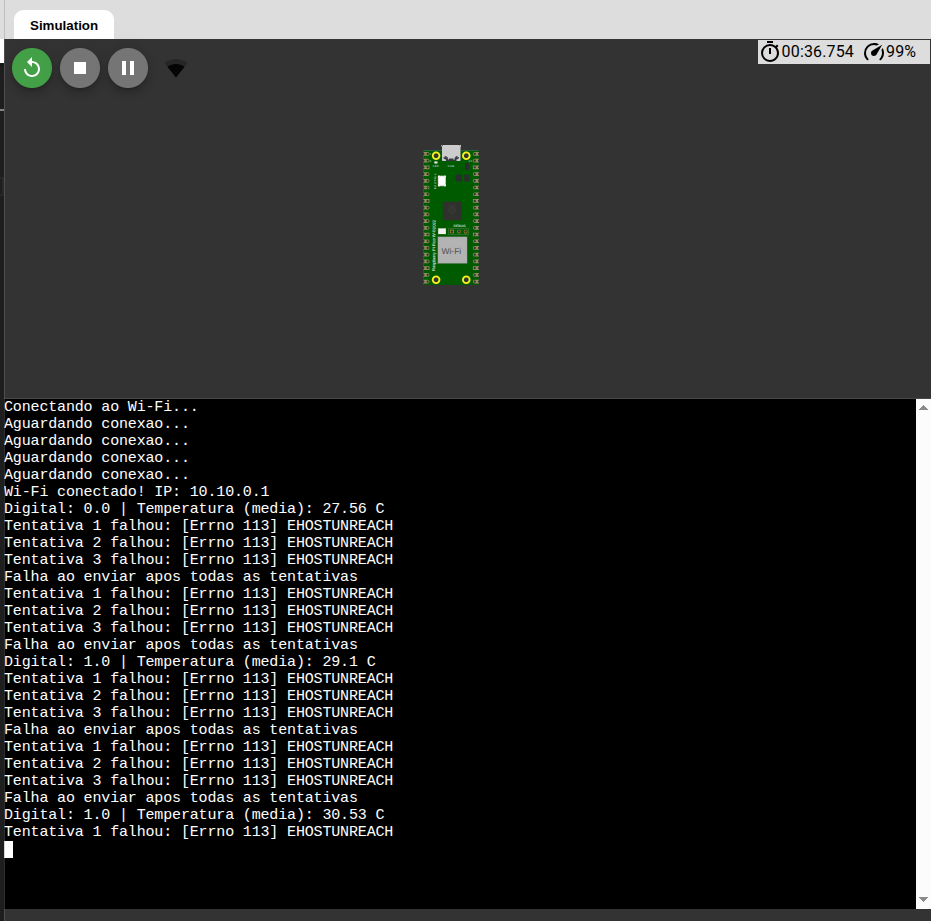
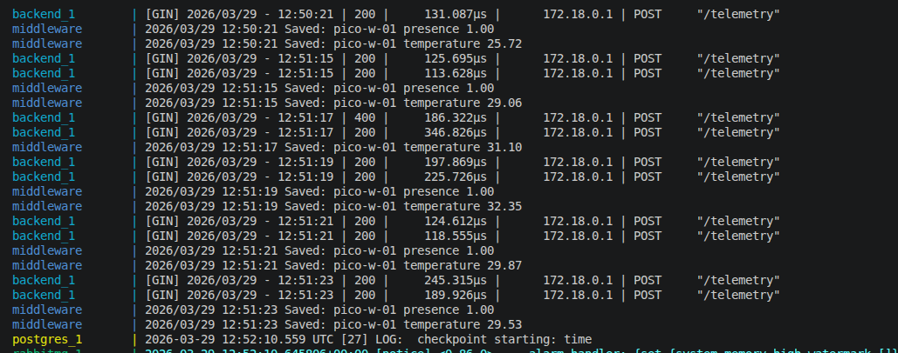
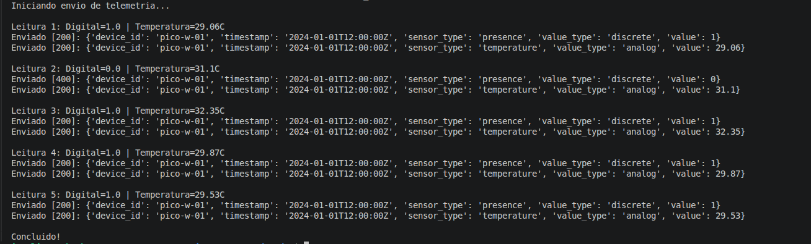

# Atividade Ponderada 3

Firmware em MicroPython para Raspberry Pi Pico W que lê sensores mockados
e envia telemetria para o backend da Atividade 1.

> **Repositório da Atividade 1:** https://github.com/lupetenazzi/m09-fila

---

## Framework / Toolchain

- **Linguagem:** MicroPython
- **Simulador:** [Wokwi](https://wokwi.com)

A atividade foi realizada no wokwi por ser um simulador com suporte nativo ao Raspberry Pi Pico, permitindo demonstrar o firmware sem a necessidade de um hardware físico ou sensores reais. O arquivo `main.py` é o firmware que roda diretamente no simulador Wokwi. O arquivo `test_telemetria.py` é um script Python auxiliar utilizado para validar o envio real de telemetria ao backend, já que o Wokwi não consegue acessar servidores locais (localhost).

---

## Sensores integrados

| Sensor | Tipo | Pino GPIO | Range de valores |
|---|---|---|---|
| Sensor de presença (mockado) | Digital (GPIO) | GP15 | 0 ou 1 |
| Sensor de temperatura (mockado) | Analógico (ADC) | GP26 (ADC0) | 20.0 °C a 35.0 °C |

Os valores são gerados via `random` no firmware, simulando leituras reais.
O sensor digital implementa debouncing por maioria (3 leituras, vence o valor
que aparecer ao menos 2 vezes). O sensor analógico implementa média móvel
sobre as últimas 5 leituras.

---

## Instruções de compilação e gravação

### No simulador Wokwi (recomendado)
1. Crie um novo projeto **Raspberry Pi Pico W**
2. Copie o conteúdo de `main.py` para o editor
3. Clique em **Run ▶** para iniciar a simulação

### Validação local com backend real
1. Suba o backend da Atividade 1:
```bash
cd ../m09-fila
docker-compose up --build
```
2. Em outro terminal, dentro deste atual repositório:
```bash
pip install requests --break-system-packages
python3 test_telemetria.py
```

---

## Configuração de rede

As configurações ficam no topo do `main.py`:
```python
WIFI_SSID = "SeuSSID"          # nome da rede Wi-Fi
WIFI_PASSWORD = "SuaSenha"     # senha da rede Wi-Fi
BACKEND_URL = "http://<IP>:8080/telemetry"  # endpoint do backend
DEVICE_ID = "pico-w-01"        # identificador do dispositivo
```


---

## Evidências de funcionamento

### 1. Firmware rodando no Wokwi — leituras de sensores e retry


O simulador mostra o Raspberry Pi Pico W rodando o firmware MicroPython com:
- Conexão Wi-Fi estabelecida com sucesso (IP: 10.10.0.1)
- Leituras dos sensores digital e analógico a cada 2 segundos
- Mecanismo de retry acionado (3 tentativas por envio) ao tentar alcançar
  o backend — comportamento esperado, pois o Wokwi roda na nuvem e não
  consegue acessar servidores locais (localhost)

### 2. Requisições HTTP chegando no backend da Atividade 1


Log do docker-compose mostrando as requisições POST chegando no endpoint
`/telemetry` com status `200`, processadas pelo `backend_1` e confirmadas
pelo `middleware` com mensagens `Saved: pico-w-01 presence` e
`Saved: pico-w-01 temperature`. Validação realizada via `test_telemetria.py`
com o backend rodando localmente.

### 3. Script de validação — envio real de telemetria


Terminal mostrando o script `test_telemetria.py` enviando 5 leituras ao
backend com respostas `[200]` para os dois tipos de sensor. O `[400]` na
leitura 2 para o sensor `discrete` com valor `0` é um comportamento
identificado no backend da Atividade 1 — o handler Go rejeita `0` como
valor discreto. Todos os demais envios foram aceitos com sucesso.

---

## Arquivos do repositório

| Arquivo | Descrição |
|---|---|
| `main.py` | Firmware MicroPython no Wokwi |
| `test_telemetria.py` | Script de validação local para envio real ao backend |
| `evidencias/` | Prints e screenshots das evidências de funcionamento |